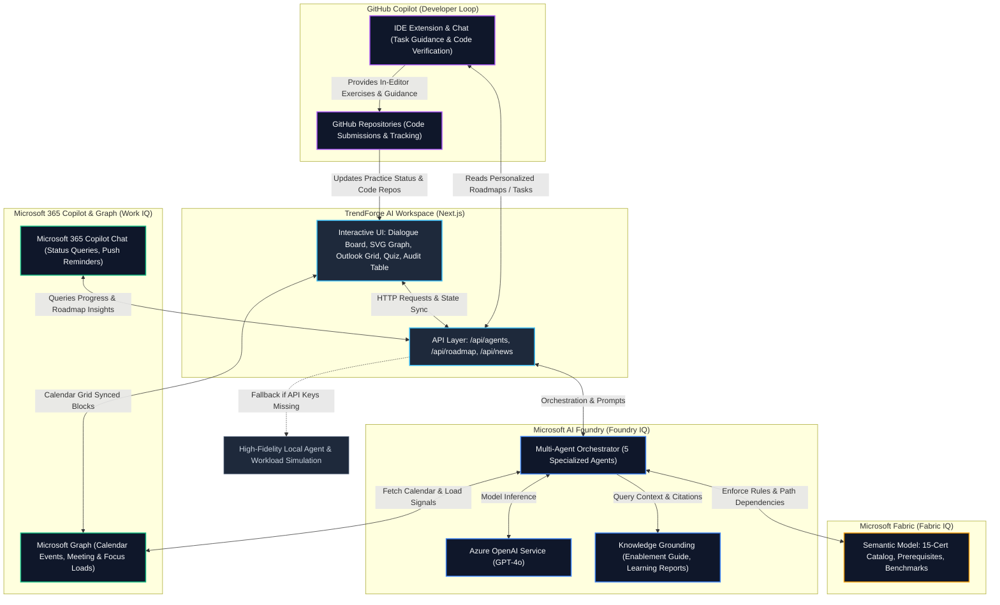

# ⚡ TrendForge AI & Reasoning Agents Enterprise Workspace

> **Real-Time AI Career & Technology Intelligence & Multi-Agent Enterprise Learning Workspace**

TrendForge AI is a premium, state-of-the-art Next.js web application designed to eliminate career guesswork. By aggregating live technology signals across the web (including GitHub, Hacker News, and global tech feeds) and reasoning over them using Advanced LLM architectures, TrendForge AI generates hyper-personalized, trend-aware learning roadmaps and industry insights for modern developers.

It now integrates the **Microsoft Foundry "Reasoning Agents" Enterprise Learning System (Challenge A)** — a state-of-the-art interactive workspace demonstrating collaborative multi-agent orchestration, grounded knowledge retrieval, work-context sync, and semantic business modeling.

---

## 🚀 Key Features

### 1. 🧠 Reasoning Agents Enterprise Workspace (`/agents`) [NEW]
Built to satisfy the Microsoft Foundry challenge requirements, this module provides an active simulation of 5 specialized agents coordinating training:
- **Learning Path Curator Agent (Foundry IQ Grounded)**: Maps target certifications to skills and retrieves citations from approved engineering enablement documents.
- **Study Plan Generator Agent (Fabric IQ Grounded)**: Automatically distributes study workloads over calendar weeks and implements semantic prerequisites and hour allocations.
- **Engagement Agent (Work IQ Grounded)**: Personalizes notification pacing and protects calendar slots based on candidate meeting loads.
- **Assessment Agent (Foundry IQ Grounded)**: Dynamically constructs scenario-based practice assessments containing citations and explanations.
- **Manager Insights Agent (Work & Fabric IQ)**: Summarizes aggregate risk metrics and pass probabilities for management view.

**Key Interactive Workflows:**
- **Agent Dialogue Board**: Real-time message console rendering the live conversational debate between the agents as they customize a learning path.
- **SVG Topology Graph**: An animated node map showing active node statuses and data flow pulses.
- **Outlook Calendar Sync**: Fully interactive calendar grid. Click empty slots to block/unblock study sessions. Hover over company meetings (daily sync standups, design reviews) to read detailed event tooltips, organizers, and conflict parameters.
- **Practice Assessment Quiz**: Features a database of 30 realistic Microsoft exam scenario questions (2 per cert) strictly filtered by the selected certification. Passing dynamically suggests career advancement targets.
- **Manager Audit Table**: Renders an registry table auditing candidate names, roles, study times, average scores, and ready statuses.

### 2. 🏠 Landing Page (Home)
- **Live Signal Tracker**: Displays real-time trending scores for high-velocity technologies (e.g., AI Agents, MCP Servers, LangGraph).
- **Market Intelligence Grid**: Highlights the fastest-growing AI skills, highly demanded roles, and immediate technological shifts.

### 3. 📊 Live Trend Dashboard (`/dashboard`)
- **Visual Analytics**: Interactive 7-day trend area charts ("Tech Trend Wave") mapping developer interest across domains.
- **Breaking News Ticker**: Shows live developer telemetry updates with computed impact scores.

### 4. 🔍 Deep-Dive Tech Analytics (`/trends`)
- **AI Tech Stack Analyzer**: An interactive lookup engine allowing users to query any language, framework, database, or tool to pull live growth, demand, and 12-month forecasts.
- **Market Domain Radar**: Recharts-powered radar visualization representing current demand shares.

### 5. 📰 Tech News Intelligence Feed (`/news`)
- **Live Scraper API**: Fetches live articles and categorizes them automatically.
- **Impact & Sentiment Analysis**: Dynamically scores article impact and maps it visually.

### 6. 🧠 AI Roadmap Generator (`/roadmap`)
- **Interactive Profiler**: Collects user skillsets, target roles, timeline preferences, and experience levels to compile week-by-week study roadmaps with capstone projects and hiring probabilities.

---

## 🏗️ Architecture Overview

The TrendForge AI platform is built around a multi-tier integration of the **Microsoft IQ** intelligence layers, Microsoft AI Foundry, Microsoft 365 Copilot, and GitHub Copilot, ensuring that learning paths are grounded in corporate documents, aligned with business metrics, and tailored around employee calendar availability.



### 🧠 Integration Details

1. **Microsoft AI Foundry (Foundry IQ)**: 
   - Orchestrates the **Reasoning Agents** workspace (`/agents`), utilizing five specialized AI agents.
   - Feeds grounded information to the **Learning Path Curator** and **Assessment** agents, retrieving precise citations from internal documentation (e.g. `Engineering Certification Enablement Guide`) to reduce hallucinations.
   - Resolves model inferences using **Azure OpenAI Service (GPT-4o)** via the configured endpoints.

2. **Microsoft Fabric (Fabric IQ)**:
   - Configured with a semantic model representing the complete **15-certification path catalog**, tracking dependencies, and prerequisites.
   - Guides the **Study Plan Generator** agent to allocate study hours dynamically, ensuring prerequisite sequences are strictly followed.

3. **Microsoft 365 Copilot & Microsoft Graph (Work IQ)**:
   - Synchronizes learning pacing with employee workloads by analyzing meeting frequency and focus hours via **Microsoft Graph API**.
   - Feeds work signals into the **Engagement** agent to protect focus hours in the Outlook calendar, while Microsoft 365 Copilot Chat acts as a conversational partner allowing users to query their progress.

4. **GitHub Copilot (Developer Learning Loop)**:
   - Connects the generated roadmap to the developer's local workspace, where GitHub Copilot provides contextual coding assistance and exercises mapped directly to the active certification track.
   - Code submissions to GitHub trigger progress updates that feed back to the TrendForge AI dashboard.

---

## 📁 15-Certification Catalog Configuration (Fabric IQ)

The semantic engine supports the complete hierarchy of 15 Microsoft certifications. Passing a path dynamically recommends the next advanced expert certification:
1. **AZ-204**: Azure Developer Associate *(Cloud Engineer)* -> **AZ-400** or **AZ-305**
2. **AZ-400**: DevOps Engineer Expert *(DevOps Engineer)* -> **AZ-500**
3. **DP-203**: Azure Data Engineer Associate *(Data Engineer)* -> **DP-100** or **DP-300**
4. **AZ-305**: Azure Solutions Architect Expert *(Solutions Architect)* -> **AZ-400**
5. **AI-102**: Azure AI Engineer Associate *(AI Engineer)* -> **DP-100**
6. **DP-100**: Azure Data Scientist Associate *(Data Scientist)* -> **AZ-305**
7. **AZ-104**: Azure Administrator Associate *(IT Administrator)* -> **AZ-305** or **AZ-500**
8. **AZ-500**: Azure Security Engineer Associate *(Security Engineer)* -> **SC-200**
9. **SC-200**: Security Operations Analyst Associate *(Security Operations Analyst)* -> **AZ-500**
10. **PL-300**: Power BI Data Analyst *(BI Analyst)* -> **DP-203**
11. **DP-300**: Azure Database Administrator Associate *(Database Administrator)* -> **DP-203**
12. **AZ-900**: Azure Fundamentals *(Junior Engineer)* -> **AZ-104** or **AZ-204**
13. **AI-900**: Azure AI Fundamentals *(AI Enthusiast)* -> **AI-102**
14. **DP-900**: Azure Data Fundamentals *(Junior Data Analyst)* -> **DP-203** or **PL-300**
15. **MS-900**: Microsoft 365 Fundamentals *(IT Support)* -> **AZ-900**

---

## ⚙️ Environment Configuration & Installation

### Prerequisites
Make sure you have [Node.js](https://nodejs.org/) (v18.x or later) and `npm` installed.

### 1. Setup Environment Variables
Create a `.env.local` file in the root of the `trendforge-ai/` directory and configure the following variables:

```env
# Microsoft Azure AI Foundry & Azure OpenAI Settings
AZURE_OPENAI_ENDPOINT=https://your-resource-name.openai.azure.com/
AZURE_OPENAI_API_KEY=your_azure_openai_api_key
AZURE_OPENAI_DEPLOYMENT=gpt-4o
AZURE_OPENAI_API_VERSION=2024-02-15-preview

# Microsoft Foundry Project Endpoints (Challenge Inputs)
AZURE_AI_PROJECT_ENDPOINT=your-project-endpoint-here
AZURE_AI_MODEL_DEPLOYMENT=gpt-4o

# Telemetry News APIs
NEWSAPI_KEY=your_newsapi_key
GNEWS_API_KEY=your_gnews_key
```

> [!NOTE]
> If Azure OpenAI/Foundry credentials are not configured in `.env.local`, TrendForge AI automatically falls back to a high-fidelity local simulation system that calculates trend frequencies, structures study roadmaps, runs the multi-agent chat debate, filters grounded practice questions, and performs calendar synchronization dynamically.

### 2. Install Dependencies
Navigate to the project directory and install the required packages:
```bash
npm install
```

### 3. Run the Development Server
Launch the local server using Next.js Turbopack compiler for fast builds:
```bash
npm run dev
```

### 4. Open the Application
Open your browser and navigate to:
```url
http://localhost:3000
```
To access the Reasoning Agents system directly, go to `http://localhost:3000/agents`.

---

## ⚡ GitHub & Vercel Deployment Instructions

Follow these instructions to push the code to GitHub and deploy it on Vercel.

### 1. Push Code to GitHub

If you have initialized a Git repository, stage, commit, and push your changes to your remote repository:

```bash
# Check status and track modified files
git status

# Stage all files
git add .

# Commit your changes
git commit -m "feat: integrate reasoning agents workspace, 15-cert catalog, and vercel analytics"

# Push to your GitHub repository
git push origin main
```

### 2. Deploy to Vercel

You can deploy TrendForge AI to Vercel either via the Vercel Dashboard (recommended) or the Vercel CLI.

#### Option A: Vercel Dashboard (Git Integration)
1. Go to the [Vercel Dashboard](https://vercel.com/dashboard) and log in.
2. Click **Add New** -> **Project**.
3. Import your GitHub repository `sabareeshsp7/TrendForge-AI`.
4. In the **Configure Project** step:
   - Expand the **Environment Variables** section.
   - Add the keys and values from your `.env.local` file (e.g., `AZURE_OPENAI_ENDPOINT`, `AZURE_OPENAI_API_KEY`, etc.).
5. Click **Deploy**. Vercel will automatically build and deploy your application. Every subsequent push to your `main` branch will trigger a production deployment.

#### Option B: Vercel CLI
If you have Vercel CLI installed locally, you can deploy directly from your terminal:
1. Install/authenticate Vercel CLI:
   ```bash
   npm install -g vercel
   vercel login
   ```
2. Run the deployment setup from the project root:
   ```bash
   vercel
   ```
3. Set up the environment variables when prompted or configure them in the project dashboard afterwards.
4. Deploy to production:
   ```bash
   vercel --prod
   ```

### 3. Verify Vercel Analytics Integration
TrendForge AI is integrated with `@vercel/analytics` to track real-time page views and user engagement.
- Once deployed, visit your live Vercel URL.
- Go to the **Analytics** tab in your Vercel Dashboard.
- If data does not display within 30 seconds, ensure you do not have content blockers active and click through the `/agents`, `/dashboard`, and `/trends` pages to trigger analytics events.

---

## 🌐 API Reference

### `POST /api/agents`
Orchestrates the multi-agent simulation for a selected employee and target certification.
- **Request Body**:
  ```json
  {
    "employeeId": "EMP-001",
    "certificationId": "AZ-204",
    "customNotes": "accelerate pace by 20%"
  }
  ```
- **Response**: Returns a structured JSON containing:
  - `agentChatLog`: Array of debate messages between the 5 agents.
  - `curator`, `planner`, `engagement`, `assessment`, and `manager` results matching the requested schema.

### `POST /api/roadmap`
Generates or refines week-by-week learning paths based on skills, target goals, timelines, and difficulty level.

### `GET /api/news`
Scrapes global headlines and returns tech-relevant developer news scored by impact.

---

## 📄 License
This project is licensed under the [MIT License](LICENSE).
